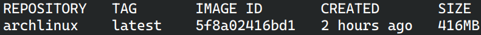
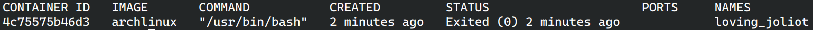
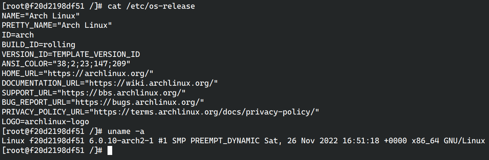
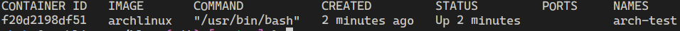

Docker是啥不用多说了。
<!-- more -->
## 先决条件
* Arch Linux x86_64
* 大于2GB的RAM
* `root` 权限

## 开始安装
1. 通过 `pacman` 安装 `docker` 软件包 ->
    ```bash
    sudo pacman -S docker
    ```
2. 在系统启动时自动启动 `docker` 守护程序 ->
    ```bash
    sudo systemctl enable docker
    ```
3. 启动 `docker` 服务 ->
    ```bash
    sudo systemctl start docker
    ```
4. 加入能够使用 `docker` 守护程序的 `docker` 组 ->
    ```bash
    sudo usermod -G docker -a $USER
    ```
5. 重新启动 `docker` 守护程序 ->
    ```bash
    sudo systemctl restart docker
    ```
---
## 后续部分
1. 验证 `docker` 是否在运行 ->
    ```bash
    docker version
    ```
2. 运行下面的命令将从 `dockerhub` 拉取并运行“Hello World” docker 容器 ->
    ```bash
    docker run archlinux
    ```
## 一些技巧
1. 列出容器镜像 ->
    ```bash
    docker image ls
    ```
    
2. 列出所有容器 ->
    ```bash
    docker container ls -a
    ```
    
3. 删除容器 ->
    ```bash
    docker container rm CONTAINER_NUMBER
    ```
    对于这个 `CONTAINER_NUMBER`，也支持简写。
4. 删除镜像 ->
    ```bash
    docker image rm -f IMAGE_NUMBER
    ```
    这个 `IMAGE_NUMBER` 也支持简写。
5. 启动 `Linux` 镜像并进行 `chroot` 进入 ->
    ```bash
    docker run -it --name arch-test archlinux
    ```
    这个命令是创建一个名为 `arch-test` 的容器，使用 `archlinux` 镜像作为模板并进行 `chroot` 进入。
    
    使用 `docker ps` 命令查看容器信息。
    