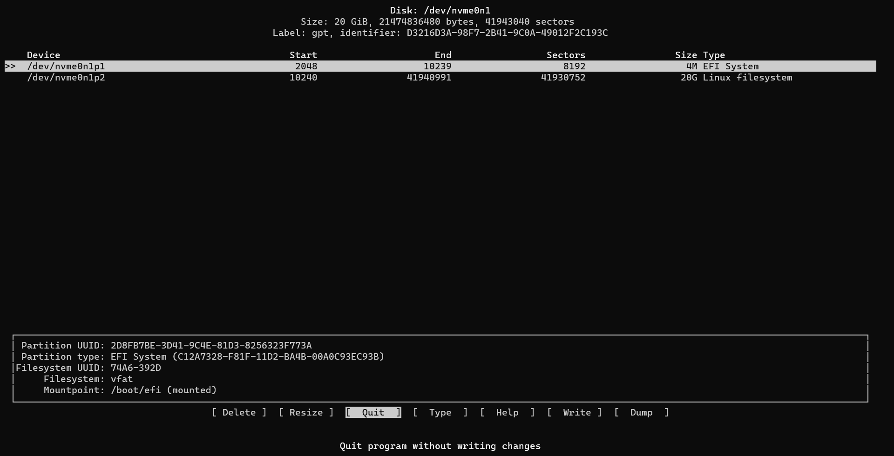
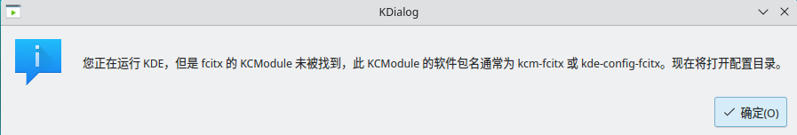
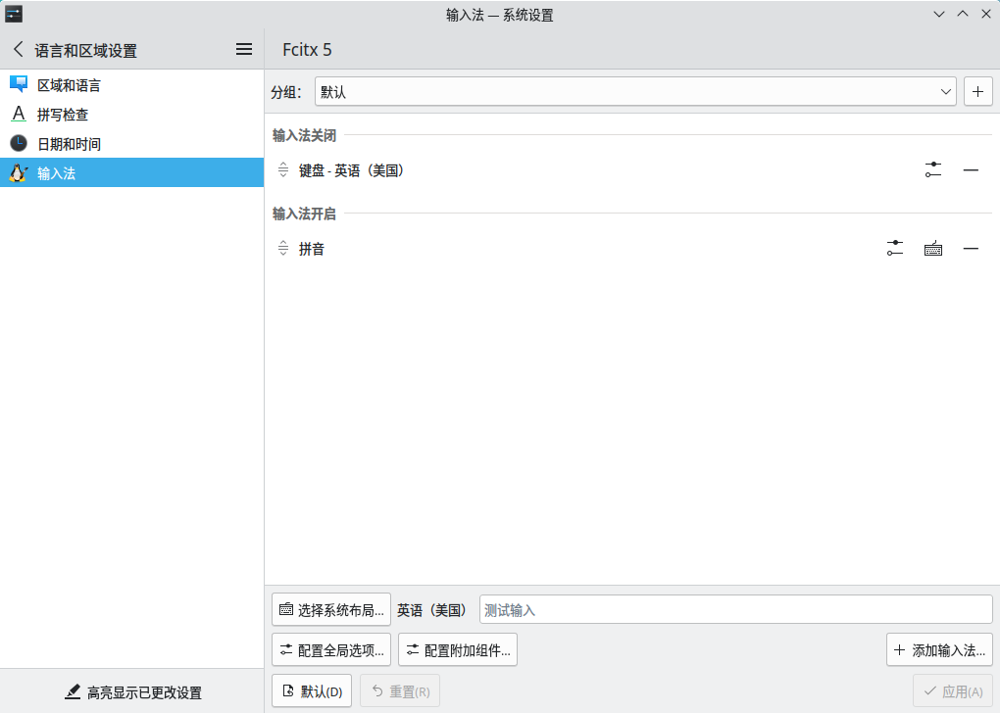

**此文章适用于现代（2010年及以后）的x86_64机器**
<!-- more -->
用了这么长时间Arch，总该写一篇安装教程了。
截至教程发布日，Arch Linux Live CD的最新版本是2024年5月的，经测试没有问题。
## 支持的硬件
**·x86_64架构的CPU，建议为2008年以后的CPU
·至少有1GB内存（Arch Wiki上写的最小的512MB现在已经无法启动11月的Live CD）
·可用的网络连接
·20GB可用的硬盘空间**
## 具体步骤
### 制作安装介质
1. 到镜像站去下载最新的Arch Linux Live CD iso ->
`https://mirrors.ustc.edu.cn/archlinux/iso/latest/archlinux-x86_64.iso`
2. 使用工具将其写入到USB驱动器或者刻录光盘（不建议）
    推荐写入工具[balenaEtcher](https://mirrors.bfsu.edu.cn/github-release/balena-io/etcher/LatestRelease/)
3. 重启后按主板厂商的指引设置USB启动或选择USB启动（若失败请先关闭安全启动[^1]）
4. 从USB驱动器引导后就进入了Live CD环境
### Live CD设置
1. 连接网络 ->
    **WIFI:**
    ```bash
    iwctl station wlan0 scan
    iwctl station wlan0 get-networks
    iwctl station wlan0 connect $SSID --passphrase $PASSWORD #$SSID代表WIFI的名字，$PASSWORD代表密码
    ip addr
    ```
    **如果直接插网线的话上面的步骤可以跳过**
    
    如果没有`wlan0`的话，可能是没有无线网卡或者是没有驱动，请插网线。如果没有RJ45网口，请移步Manjaro（
    
    若`ip addr`返回了wlan0的信息并且下面有正确的ip，则代表网络已连接成功。
    可选：停止`reflector`服务，防止`/etc/pacman.d/mirrorlist`被写入其他地区镜像 ->
    ```bash
    systemctl stop reflector.service
    ```
2. 配置镜像
    由于结界，我们无法直接从结界外部的镜像站获取软件包。在Live CD内也无法使用魔法绕过结界，所以步前辈们的足迹，使用他们搭建好的国内镜像站（注意：这一步须在`reflector.service`停止后进行，可手动结束或等待其执行完成，否则编辑完的`mirrorlist`会被它重写） ->
    ```bash
    vim /etc/pacman.d/mirrorlist
    ```
    * 在文件开头按`i`进入`insert`模式，添加`Server = https://mirrors.ustc.edu.cn/archlinux/$repo/os/$arch`
    * 按`esc`退出`insert`模式，输入`:wq`保存并退出`vim`
### 磁盘相关
1. 磁盘分区 ->
    
    这一步需要按照情况自行更改，操作不当会导致数据丢失。一定要理解下面info中的内容。
    
    
    我这台机器有一个NVME接口的固态硬盘，它的编号是`nvme0n1`。在有多个NVME接口的主板上，如果你插了多块硬盘，它将会有`nvme1n1`、`nvme2n1`等编号，一定要清楚自己要操作的是哪块硬盘。连在SATA与USB接口上的硬盘会显示`sda`、`sdb`等，`sda`可能是U盘也可能是内置硬盘，请先`lsblk`进行辨认。这条命令的意义是对`nvme0n1`进行操作，请根据自身需要更改。
    
    ```bash
    cfdisk /dev/nvme0n1
    ```
    
    如果先前有Windows安装的话，请注意不要把Windows分区直接缩小大小，会让Windows坏掉。应先使用其他工具完成分区大小调整再进行后续步骤。
    
    * 使用GPT分区表（这是UEFI引导的必须条件）
    * 推荐分区方案 ->
        * EFI分区：不小于4MB，类型：`EFI System`
        * 主分区：不小于10GB，类型：`Linux filesystem`
        （建议在分区内部建立一个swapfile来承担swap的任务）
        
    * 结束后，选`Write`再输入`yes`来写入分区表，再选`Quit`退出
2. 建立文件系统 ->
    主分区使用`ext4`文件系统
    
    如果先前安装了Windows或者其他操作系统，不要执行第一条，会导致Windows引导损坏。
    
    
    这条命令也需要自行修改，意为在`nvme0n1`的第一分区创建`vfat`文件系统，在`nvme0n1`的第二分区创建`ext4`文件系统。
    
    ```bash
    mkfs.vfat /dev/nvme0n1p1
    mkfs.ext4 /dev/nvme0n1p2
    ```
    
    如果之前`nvme0n1p2`建立过其他文件系统，这里需要按`y`确认。
    
3. 挂载分区 ->
    
    改，勿照抄。`/`的`nvme0n1p2`挂载到`/mnt`，再把`nvme0n1p1`这个EFI分区挂到`/mnt/boot/efi`下。
    
    ```bash
    mount /dev/nvme0n1p2 /mnt
    mkdir -p /mnt/boot/efi
    mount /dev/nvme0n1p1 /mnt/boot/efi
    ```
4. 创建`swapfile` ->
    
    这里`swap`创建为8G，可根据需要改变`count=`后的数字，单位是MB。当然如果内存够大也可以不用执行这些命令。
    
    ```bash
    dd if=/dev/zero of=/mnt/swapfile bs=1M count=8192
    chmod 600 /mnt/swapfile
    mkswap /mnt/swapfile
    swapon /mnt/swapfile
    ```
### 安装系统
1. 安装软件包 ->
    **首先初始化keyring！！**
    ```bash
    pacman -Sy archlinux-keyring
    ```
    #### **使用KDE Plasma作桌面环境的系统**
    `pacstrap`安装必要的包
    ```bash
    pacstrap /mnt base linux linux-firmware linux-headers base-devel git zsh zsh-completions grub efibootmgr networkmanager openssh vim plasma konsole dolphin noto-fonts-cjk noto-fonts noto-fonts-emoji noto-fonts-extra fcitx5-chinese-addons chromium fastfetch htop
    ```
    #### **使用GNOME作桌面环境的系统**
    ```bash
    pacstrap /mnt base linux linux-firmware linux-headers base-devel git zsh zsh-completions grub efibootmgr networkmanager openssh vim gnome noto-fonts-cjk noto-fonts-emoji noto-fonts-extra ibus ibus-libpinyin chromium fastfetch htop
    ```
    #### **使用命令行界面的系统(Headless)**
    这是我的习惯 ->
    ```bash
    pacstrap /mnt base linux linux-firmware linux-headers base-devel git zsh zsh-completions grub efibootmgr networkmanager openssh vim fastfetch htop
    ```
    ####
2. 生成`fstab` ->
    ```bash
    genfstab -U /mnt >> /mnt/etc/fstab
    ```
3. `chroot`到新系统 ->
    ```bash
    arch-chroot /mnt
    ```
### 初步配置系统
1. 时间设置 ->
    ```bash
    ln -sf /usr/share/zoneinfo/Asia/Shanghai /etc/localtime
    hwclock --systohc
    ```
2. 用户设置 ->
    ```bash
    echo 主机名 > /etc/hostname
    useradd -m 用户名 -G wheel
    passwd 用户名
    ```
    
    `useradd`用于添加账户，`passwd`用于修改密码，为安全考虑输入的密码不会直接显示出来。虽然没有反应，但确实是输入进去了。
    
3. 编辑`sudoers` ->
    ```bash
    visudo
    ```
    将文件中的`# %wheel ALL=(ALL:ALL) ALL`（大概率在第108行）的注释取消，使得`wheel`组里的用户可以使用`sudo`
4. 配置`zsh` ->
    
    zsh 是一个有强大客制化能力的 shell，并且 Apple 也将新 macOS 默认的 shell 换成了 zsh。现在Arch Linux Live CD 的默认 shell 就是 zsh。
    如果不喜欢zsh，或者考虑兼容性，请跳过这一步。
    
    ```bash
    su 用户名
    git clone https://mirrors.tuna.tsinghua.edu.cn/git/ohmyzsh.git ~/.oh-my-zsh
    cp ~/.oh-my-zsh/templates/zshrc.zsh-template ~/.zshrc
    chsh -s /bin/zsh
    exit
    ```
5. 本地化 ->
    ```bash
    echo "LANG=\"en_US.UTF-8\"" >> /etc/locale.conf
    sed -i "s@#zh_CN.UTF-8 UTF-8@zh_CN.UTF-8 UTF-8@g" /etc/locale.gen
    sed -i "s@#en_US.UTF-8 UTF-8@en_US.UTF-8 UTF-8@g" /etc/locale.gen
    ```
    去掉`#zh_CN.UTF-8 UTF-8`和`#en_US.UTF-8 UTF-8`的注释符号“`#`”
    最后运行 ->
    ```bash
    locale-gen
    ```
6. 服务设置 ->
    ```bash
    systemctl enable NetworkManager
    systemctl enable sshd
    systemctl enable sddm # KDE
    systemctl enable gdm # GNOME
    ```
7. 引导设置 ->
    `gurb`已支持引导Windows。
    可以让`grub`找到Windows。
    ```bash
    sudo pacman -Sy ntfs-3g fuse os-prober
    ```
    对于`UEFI`引导的安装方式
        ```bash
        grub-install --target=x86_64-efi --efi-directory=/boot/efi
        sed -i "s@#GRUB_DISABLE_OS_PROBER=false@GRUB_DISABLE_OS_PROBER=false@g" /etc/default/grub
        grub-mkconfig -o /boot/grub/grub.cfg
        ```
    对于`BIOS`引导的安装方式
        ```bash
        grub-install /dev/nvme0n1
        sed -i "s@#GRUB_DISABLE_OS_PROBER=false@GRUB_DISABLE_OS_PROBER=false@g" /etc/default/grub
        grub-mkconfig -o /boot/grub/grub.cfg
        ```
8. 退出`chroot`环境并重启 ->
    ```bash
    exit
    reboot
    ```
**至此Arch Linux的安装就完成了**
**接下来是配置部分**
### 进一步配置系统
**如果是KDE的话**，重启系统后，大概就是这样的 ->

1. 输入法配置
    如果直接`右键`-`配置`是会显示这个的 ->
    
    这会进入文本配置，显然我们是不懂的（
    所以要安装`fcitx5-configtool` ->
    ```bash
    sudo pacman -S fcitx5-configtool
    ```
    然后再`右键`-`配置`就可以看到 ->
    
    然而现在按`Ctrl+Tab`是不能切换到拼音输入法的，我们需要把`Fcitx5`设为默认输入法并自动启动 ->
    ```bash
    sudo vim /etc/environment
    ```
    把下面的东西加进去 ->
    ```text
    GTK_IM_MODULE=fcitx
    QT_IM_MODULE=fcitx
    XMODIFIERS=@im=fcitx
    SDL_IM_MODULE=fcitx
    GLFW_IM_MODULE=ibus
    ```
    重新登录就可以正常使用喵~
    更多用法请参阅[Arch Wiki](https://wiki.archlinux.org/title/Fcitx5_(%E7%AE%80%E4%BD%93%E4%B8%AD%E6%96%87))
2. 软件源
    众所周知，官方源对于灰色地带/非自由软件是不收录的。
    所以我们通常用第三方源+`AUR`来进行补充。
    官方源是不带任何`AUR`工具的，所以我们先装`archlinuxcn`源 ->
    ```bash
    sudo vim /etc/pacman.conf
    ```
    加入以下文本 ->
    ```text
    [archlinuxcn]
    Server = https://mirrors.bfsu.edu.cn/archlinuxcn/$arch
    ```
    然后获取`keyring` ->
    
    近期这一步会出现问题，因为archlinuxcn 社区源的 keyring 包 archlinuxcn-keyring 由 farseerfc 的 key 签署验证，而 Arch Linux 官方 keyring 中包含了 farseerfc 的 key 。自12月初 archlinux-keyring 中删除了一个退任的 master key (https://gitlab.archlinux.org/archlinux/archlinux-keyring/-/issues/246) 导致 farseerfc 的 key 的信任数不足，由 GnuPG 的 web of trust 推算为 marginal trust，从而不再能自动信任 archlinuxcn-keyring 包的签名。(转自Arch Linux CN Telegram Messages Channel)
    
    如果你在新系统中尝试安装`archlinuxcn-keyring`包时遇到如下报错：
    ```text
    error: archlinuxcn-keyring: Signature from "Jiachen YANG (Arch Linux Packager Signing Key) <farseerfc@archlinux.org>" is marginal trust
    ```
    请使用以下命令在本地信任 farseerfc 的 key 。此 key 已随`archlinux-keyring`安装在系统中，只是缺乏信任：
    ```shell
    sudo pacman-key --lsign-key "farseerfc@archlinux.org"
    ```
    然后
    ```bash
    sudo pacman -Sy archlinuxcn-keyring
    ```
    就可以使用`archlinuxcn`源了！
    由于要使用`AUR`，所以我们先装一个AUR工具：
    ```bash
    sudo pacman -S paru
    ```
    详细的用法和`pacman`一样。
3. 引导Windows
    在安装系统时，`os-prober`往往不能正常检测到Windows，需要我们再运行
    ```bash
    sudo grub-mkconfig -o /boot/grub/grub.cfg
    ```
    重启即可看到`Windows Boot Manager`。
## 显卡驱动
如果是A卡和I卡，在这个时候已经不用看了，开源的驱动会做得很好，而且已经随桌面环境装上了
而N卡，需要进行以下步骤
### 查看显卡型号
```zsh
lspci -k | grep -A 2 -E "(VGA|3D)"
```
GeForce 900 系以及更新的显卡（NV110+），安装 nvidia（用于官方源里的标准内核）或者 nvidia-lts（用于 linux-lts 内核）

Turing (NV160/TUXXX) 系列或更新的显卡。可以安装 nvidia-open 包，开源的（仅适用于官方源里的内核，其他内核上必须使用 nvidia-open-dkms 包）

更老的显卡型号（发布于 2010 年或更早），就用内核自带的 Nouveau
### 安装驱动
```zsh
sudo pacman -S nvidia nvidia-settings
```
### 后续
安装 NVIDIA 官方的驱动之后，需要编辑```/etc/mkinitcpio.conf```，在 HOOKS 一行删除`kms`并保存
然后执行
```zsh
mkinitcpio -P
```
重新生成一次镜像。这能防止 initramfs 包含 nouveau 模块，避免 nouveau 和官方驱动的冲突。

**到现在一个日常使用的系统已经完成了~ 剩下的请自由发挥~**
## 常用软件
1. telegram
```zsh
sudo pacman -S telegram-desktop
```
2. Visual Studio Code
```zsh
paru -S visual-studio-code-bin
```
3. Wine
先启动 `/etc/pacman.conf` 中的 `multilib` 源，其中包含32位软件

```zsh
sudo pacman -S lib32-mesa # 普通御三家卡
sudo pacman -S lib32-nvidia-utils # 绿厂闭源驱动，效果好，需要现代N卡
sudo pacman -S lib32-amdgpu-pro-oglp # 专业A卡
sudo pacman -S wine wine-gecko wine-mono lib32-alsa-lib lib32-alsa-plugins
```
4. Chrome / Edge
```zsh
paru -S microsoft-edge-stable-bin # 莫名慢速下载警告
paru -S google-chrome
```
5. 网易云替代品
Go 写的 musicfox，TUI 版网易云
```zsh
paru -S go-musicfox-git
```
6. Steam
```zsh
sudo pacman -S steam
sudo paru -S proton
```
~~现在都能玩黄油了惹~~