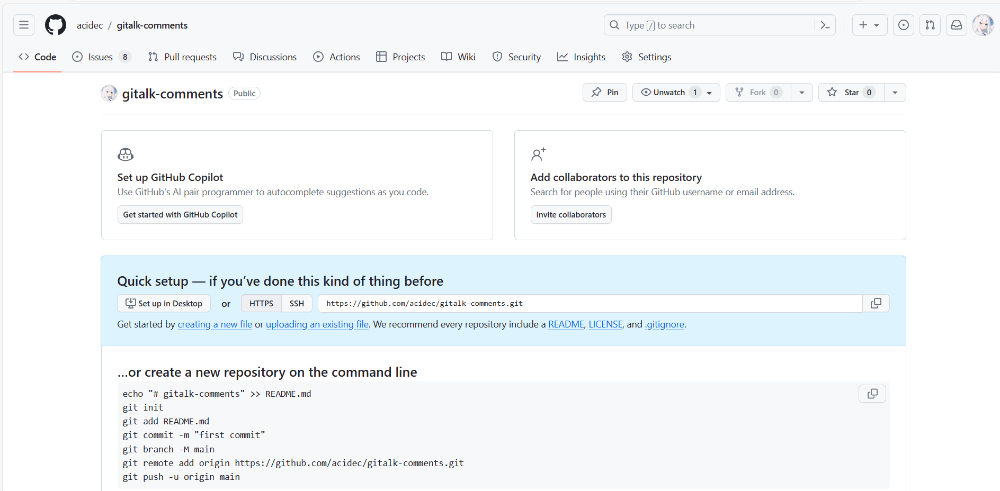
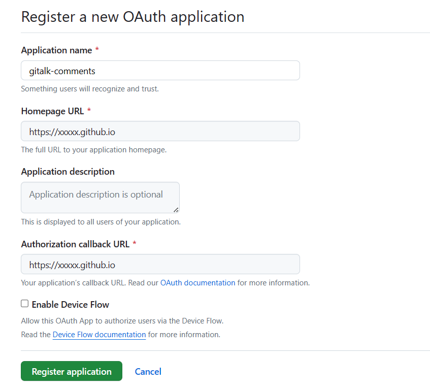

给 Hexo 加个评论插件 Gitalk
<!-- more -->
# 预处理
首先，看到这里的话，你应该已经在 Github Pages 上部署好 Hexo + Fluid 了罢
咱看 fluid 的配置文件，里面写好了**评论插件：Options: utterances | disqus | gitalk | valine...**
咱要选的就是这个 gitalk，基于 Github issue，无论是作者还是读者，有个 Github 账号就能用

## 建立用于存储评论的仓库
因为是基于 issue，所以要开一个公共 github 存储库（已存在或创建一个新的 github 存储库）来开这些 issue

就像这个一样，是空的，只要是 public 的就行
## 创建 GitHub Application

然后这个像这样填就行

记得`xxxxx`要改啊
## 把主体用 npm 装上
```powershell
npm i --save gitalk
```

# 嵌入
然后回到`_config.yml`
把
```
post:
    comments:
        enable: true
        type: gitalk

gitalk:
    clientID: 
    clentSecret: 
    repo: gitalk-comments
    owner: xxxxx
    admin: ['xxxxx']
    # 都改成自己的，前两个就在申请完 Github Application 的页面，repo 按照你的评论存储仓库填，owner 和 admin 都改成你自己的用户名
```
然后重新```hexo d -g```
这就完事了