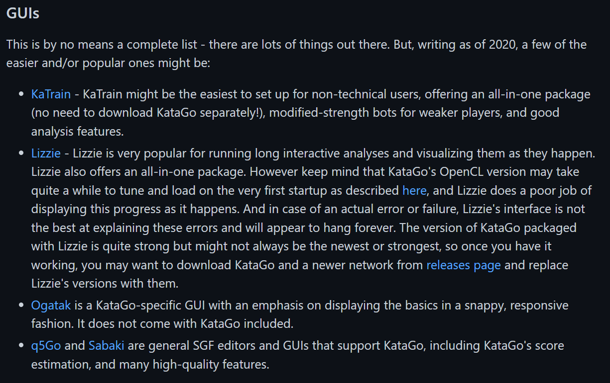
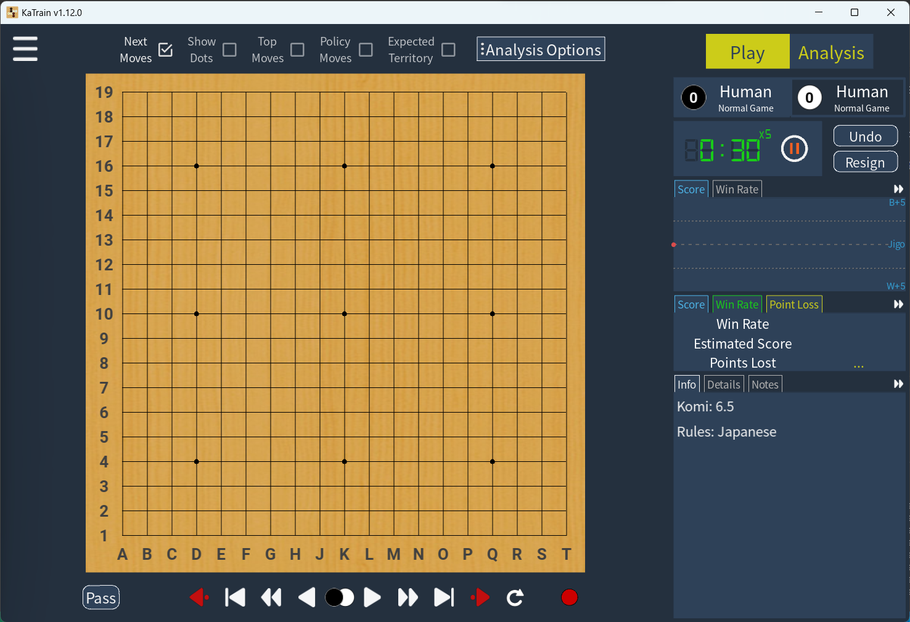
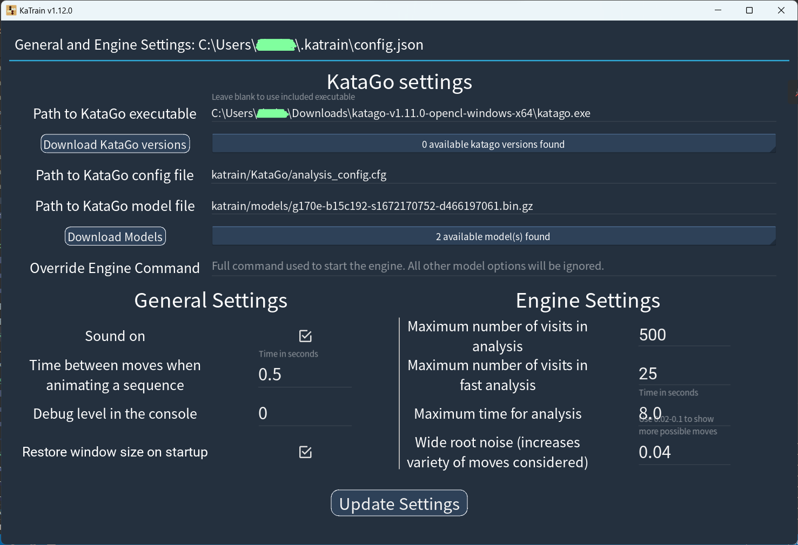
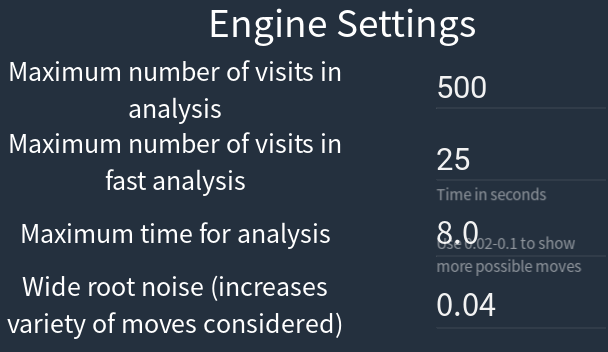

现在开源的最强围棋AI。elo大概13k+？
<!-- more -->
源代码可用。 [Github link](https://github.com/lightvector/KataGo).
## 获取模型文件
如果你有现代GPU（比如GCN1.0/Volta往后的），我建议用 OpenCL 版本。核显也是能跑的。
没卡或者卡太老的话，用 Eigen 这个用 CPU 跑的版本。还有支持 AVX2 的，要求4代 Core 以后了。
CUDA 版本配置过于繁琐，而且必须要用N卡。
Windows:

&&


Linux:

&&

**把这些解压，一会要用**
## 下 KaTrain
官方推荐的 KataGO GUI


三平台运行支持，但是
* 官方没有 Linux 版，需要自己编译;
* macOS 版本不支持 aarch64，要用 Rosetta 2 转译

Windows:

解压然后运行 `KaTrain.exe` ->

打开菜单，选择 `General & Engine Settings` ->

把模型路径放到`Path to KataGo executable`里.

## 还有
`Maximum number of visits in analysis`越大，这个 AI 越强
